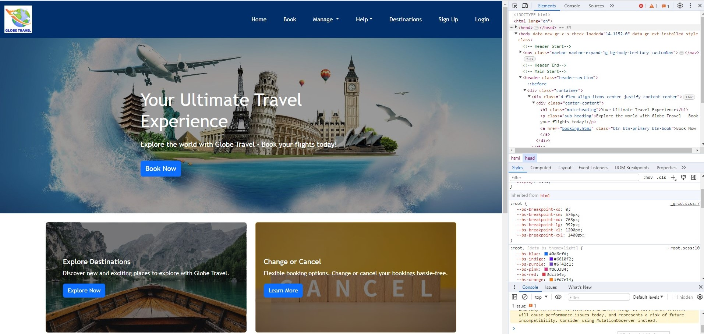

 
# Globe-travel-Website
### (This is a group project)

 
 

## Table of Contents

- [Description](#description)
- [Image](#image)
- [Technologies](#technologies)
- [Credits](#credits)
- [License](#license)

## Description

"Globe Travel" is a dynamic and user-friendly travel website desigened 
 to provide an immersive experience for users seeking informaion, 
 inspiration, and services are related to travel. The website has a clean 
 and morden design with intuitive navigation, making it easy for users.
  
 
- Home
- Book
- Manage
   - Change Booking
   - Flight Status
- Help
   - FAQs
- Destinations
- Sign Up
- Login
  
   

# Image

  
   

  # Technologies
 
 
- HTML5
 
- CSS3
 
- JAVASCRIPT
 

## Server-side APIs(Application Programming Interfaces):
refer to a set of protocols and tools that allow different software 
applictions to communicate with each other. In the context of web 
development, server-side APIs are commonly used to enable communucation  
between a client-side appliction(such as a web browser) and a server.
 
  Here are key aspects related to server-side APIs:
  1.Communication
   
  2.Functionality
   
  3.Data Exchange
   
  4.HTTP Methods
   
  5.Data Formats
   
  6.Authentication
   
  7.Frameworks and Libraries
   
  8.Statelessness
  
    
     

## Git branching workflow:
   is a strategy or set of guidelines that developers follow when    
workin with Git, a distributed version control system. Branching allows  
developers to create a independent lines of development, making it  
workflows exist, but a commonly used one is the "Feature Branch Workflow". 
Here's an overview:
 1. Main Branch(Master/Main):
  
- The main branch represents the stable version of the project. It should  
always be in a deployable state, meaning it contains the latest production-ready code.
  
 2. Feature Branches:
  
When a new feature or task needs to be implemented, a developer creates a new 
branch dedicated to that specific feature. This is called a "feature branch". 
The developer workers on the feature independently of the main branch.
3. Creating a Feature Branch:
 
- To creating a feature branch, developers typically use the following commands:

  git checkout -b feature/new-feature-name

  This command creates and switches to a new branch named "feature/new-feature-name."
  
4. Development on Feature Branch:
 
- Developers make changes, add new code, and commit their work to the feature branch.  
This allows multiple developers to work on different features simultaneously without 
interfering with each other.
 
5. Regular Updates:
 
- while working on the feature branch, developers regularly pull the latest changes 
from the main brancr to ensure their feature branch is based on the most recent code.

  git pull origin main

6. Code Review: 
- Once the feature is complete, the developer opens a pull request (PR) to merge 
their feature branch into the main branch. This is an oppertunity  for code review 
and collaboration with other team members.
 
7. Integration and Testing:
 
- The feature branch undergoes integration testing to ensure that it works well with 
the existing codebase. This step helps identify and resolve conflicts or issues that 
may arise from the merge.
 
8. Merge into Main:
  
- After the code review and successful testing, the feature branch is merged into 
the main branch. This integraion brings the new feature into the stable codebage.

9. Tagging Releases:
 
- After  significant features or bug fixes, a release may be tagged in the main branch. 
Thi allows for identificatin of specific versions and helps with version control.

   This brnching workflow promotes a systematic and collaboratve approach to development. 
Ungerstanding Git branching workflow is crucial for effective collaboration in software 
development projects.
 
 

## Agile software development
 

Agile software development is an iterative approach to software development that emphsizes 
flexibility, collaboration, and customer feedback. It contrasts with traditional "waterfall" 
methods by breaking the development process into smaller increments called iteration or sprints, 
allowing for incremental improvements and adjustments thoughout the project lifecycle. Here are 
key principales and characteristics of Agile software development:

-  Iterative and Incremental Development
 
-  Customer Collaboration
 
-  Adaptive Planing
 
-  Cross-Funtional Teams
 
-  Continuous Integration and Delivery
 
-  Emphasis on Individuals and Interactions
 
-  Working Software as primary Measure of Progress
 
-  Embracing Change
 
 

Common Agile methodologies include Scrum, Kanban, Extreme Programming (PX), and Lean Software 
Development, eatch with its own set of practices and principles tailored to different project 
contexts. By promoting collaborating, adaptability, and customer-centricity, Agile methodologes 
aim to deliver high-quality software that meets customer needs efficiently and effectively.
 
 

# Credits
 

https://bootcampspot.instructure.com/courses/5076
https://www.freecodecamp.org/news/how-to-write-a-good-readme-file/
https://www.markdownguide.org/cheat-sheet
https://fontawesome.com/search

    
## License

 
 
-  👉 This project is licensed under the MIT License.
 
License: MIT License
Copyright (c) 2023

Permission is hereby granted, free of charge, to any person obtaining a copy of 
this software and associated documentation files (the "Software"), to deal in the 
Software without restriction, including without limitation the rights to use, copy, 
 modify, merge, publish, distribute, sublicense, and/or sell copies of the Software, 
and to permit persons to whom the Software is furnished to do so, subject to the 
following conditions:

The above copyright notice and this permission notice shall be included in all copies  
or substantial portions of the Software.

THE SOFTWARE IS PROVIDED "AS IS", WITHOUT WARRANTY OF ANY KIND, EXPRESS OR IMPLIED, 
INCLUDING BUT NOT LIMITED TO THE WARRANTIES OF MERCHANTABILITY, FITNESS FOR A PARTICULAR 
PURPOSE AND NONINFRINGEMENT. IN NO EVENT SHALL THE AUTHORS OR COPYRIGHT HOLDERS BE LIABLE FOR 
ANY CLAIM, DAMAGES OR OTHER LIABILITY, WHETHER IN AN ACTION OF CONTRACT, TORT OR OTHERWISE,  
ARISING FROM, OUT OF OR IN CONNECTION WI
  
